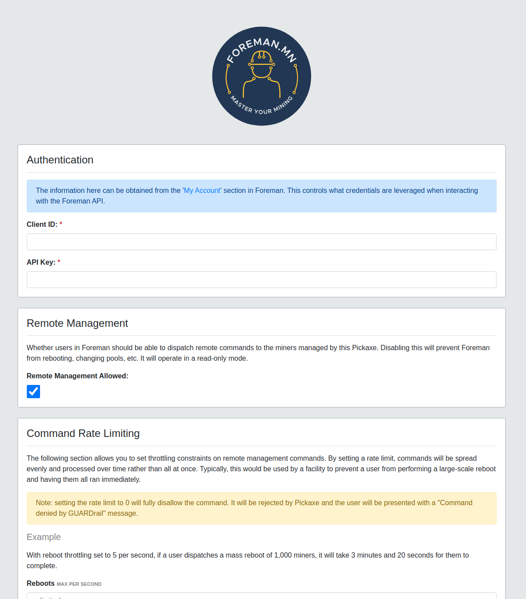

# foreman-guardrail

## Status


## GUARDrail

GUARDrail is an open-source Java application that provides a mechanism to set
constraints on [Pickaxe](https://github.com/foremanmining/foreman-apps), the
Foreman miner monitoring and management agent. This application is intended to
be used in a miner hosting environment where the facility would like to apply
local constraints, limiting the IPs that the Foreman agent can reach. This puts
the operator fully in control.

A typical use case for this would be:

- A colocation/hosting facility has many miners hosted, each owned by different
  customers
- The facility would like to allow the customer access to their miners
  through [Foreman](https://foreman.mn)
- The facility would like to apply local constraints rather than relying fully
  on [Foreman dashboard permissions](https://foreman.mn/blog/managing-access-to-cryptocurrency-miners/)
  to guarantee that no other miners are reachable
- A colocation/hosting facility would like to throttle Foreman-side remote miner
  commands to prevent power fluctuations that would typically result from a user
  performing a large-scale reboot, pool change, etc

## Requirements

- JDK version 8 (or higher)
- Linux (this application is currently not compatible with Windows)

## Usage

Since this application is currently only supported on Linux, it's automatically
installed if the `GUARDRAIL` environment variable is set to
`true`. Example:

```sh
$ curl https://tinyurl.com/service-install -Ls --output install.sh; GUARDRAIL=true sudo -E bash install.sh <client_id> <api_key>
```

Once it's running, you can access it at the following address:
`http://<computer ip>:25452`:



### Setting Constraints

#### Authentication

The Authentication parameters specify the client ID and API key that the local
Pickaxe should use when interacting with Foreman. Those can be found
[here](https://dashboard.foreman.mn/dashboard/profile/) (note: you must be
logged in). Once they're changed, it can take up to 1 minute for Pickaxe to
switch to the new credentials.

#### Remote Management

This option controls whether Foreman should operate as read-only. Read-only
drops all commands that would come from the dashboard that could modify the
miner (change pools, reboot, etc). Pickaxe will only query statistics.

#### Command Rate Limiting

This allows a facility to set facility-side constraints that will limit how
quickly batch commands can be executed against miners. By setting a rate limit
on a remote command, those commands will not execute quicker that the rate
specified. Example: with reboot throttling set to a max of 5 per second, if a
user dispatches a mass reboot of 1,000 miners, it will take 3 minutes and 20
seconds for them to complete.

#### MAC Restrictions

MAC Restrictions provide a mechanism for limiting the MAC addresses that Pickaxe
can publish to the Foreman API. As an example, if a miner network was DHCP and
the IPs shuffled, GUARDrail will block a different miner's data from leaving the
facility if the MAC address is different.

MACs are provided one per line. Example:

```
02:1f:85:92:80:5a
02:ad:db:b9:cd:67
3c:a3:08:57:70:74
```

#### IP Restrictions

IP Restrictions provide a mechanism for limiting the IPs that Pickaxe can reach
regardless of the constraints in place on the Foreman dashboard. As an example,
if a user were to dispatch a `reboot` to the IP `10.10.1.5`, but that IP wasn't
in the **Allowed Ranges**, then the command would fail.

Either individual IPs or nmap-formatted ranges can be provided. Example:

```
10.0.1.2
10.0.2.6
10.1.5.5
10.2.1-2.1-3
```

Would allow:

```
10.0.1.2
10.0.2.6
10.1.5.5
10.2.1.1
10.2.1.2
10.2.1.3
10.2.2.1
10.2.2.2
10.2.2.3
```

## Building

To build the entire foreman-guardrail repository, from the top level of the
repository:

```sh
$ mvn clean install
```

Upon a successful build, you should see something similar to the following:

```sh
[INFO] ------------------------------------------------------------------------
[INFO] BUILD SUCCESS
[INFO] ------------------------------------------------------------------------
[INFO] Total time: 39.070 s
[INFO] Finished at: 2018-07-07T19:54:47-04:00
[INFO] Final Memory: 46M/494M
[INFO] ------------------------------------------------------------------------
```

The application distributions can be found in the `target/` folder. You'll only
need one - pick the extension you prefer.

```sh
$ ls -la target | grep -E "\.(zip|tar)"
-rw-r--r--  1 dan dan 9621049 Jul  7 19:54 foreman-guardrail-1.0.0-SNAPSHOT-bin.tar.bz2
-rw-r--r--  1 dan dan 9662936 Jul  7 19:54 foreman-guardrail-1.0.0-SNAPSHOT-bin.tar.gz
-rw-r--r--  1 dan dan 9669478 Jul  7 19:54 foreman-guardrail-1.0.0-SNAPSHOT-bin.zip
$

```

## License

Copyright © 2021, [OBM LLC](https://obm.mn/). Released under
the [GPL-3.0 License](LICENSE).